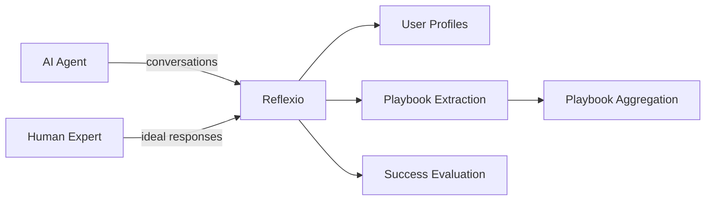

<p align="center">
  <a href="https://github.com/reflexio-ai/reflexio">
    
  </a>
</p>
<div align="center">

[](https://www.python.org/)
[](LICENSE)
[](https://pypi.org/project/reflexio-client/)
[](https://pepy.tech/project/reflexio-ai)
[](reflexio/benchmarks/retrieval_latency/results/report.md)
[](https://github.com/ReflexioAI/reflexio/stargazers)

[Quick Start](#quick-start) · [Features](#features) · [Integrations](#integrations) · [SDK](#sdk-usage) · [CLI](reflexio/cli/README.md) · [Architecture](#architecture) · [Docs](https://www.reflexio.ai/docs) · [Contributing](#contributing)

</div>

---

<p align="center">
  <b>81% fewer planning steps</b> &nbsp;·&nbsp; <b>72% less tokens</b> &nbsp;·&nbsp; on real GDPVal knowledge-work tasks, <br/>
  <i>on top of</i> what a SOTA self-improving Hermes agent already learns on its own.<br/>
  <a href="benchmark/gdpval/RESULTS.md"><b>See the benchmark →</b></a>
</p>

---

### Migration from claude_code integration (removed in this release)

The `reflexio setup claude-code` command and its hook files have been removed.
The replacement is **[claude-smart](https://github.com/ReflexioAI/claude-smart)**,
a standalone Claude Code plugin distributed via npm.

*This migration only removes the **hook/plugin installation** path. The local
`claude-code` LLM provider routing (used to call Anthropic via the Claude Code
CLI binary as a model backend) remains available — only remove obsolete hook
entries, not your provider configuration.*

**If you had the old integration installed**, your `.claude/settings.json` (per-project)
or `~/.claude/settings.json` (global) likely has hook entries referencing files that no longer exist.
Open the file and remove any `hooks` entries that reference paths under `reflexio/integrations/claude_code/`
or `integrations/claude_code/`. Then run `npx claude-smart install` (or use the Claude Code plugin marketplace)
for the modern equivalent.

---

## What is Reflexio?
Reflexio is an **AI agent self-improvement harness** that enables your AI agents to continuously learn from real user interactions. It turns user corrections into persisted behavioral improvements for agents and capturing successful execution paths for reuse.  

What one user teaches, every user benefits from.  

As your agent is used more, it becomes smarter, faster, and more effective at solving domain-specific tasks.
The moat for AI agents is what your agent learns from every interaction it handles.  

Our vision is that AI systems should get better with every interaction.

> **Benchmarked on GDPVal**: on 4 of 5 real knowledge-work tasks from OpenAI's public GDPVal benchmark, Reflexio cuts a **median −81% planning steps and −72% tokens** on a Hermes agent running `minimax/MiniMax-M2.7` — measured against a *warm baseline*: the same agent re-running the task after it has already learned from itself. In other words, Reflexio's savings come **on top of** what a SOTA self-improving agent has learnt on its own. See the full writeup → [benchmark/gdpval/RESULTS.md](benchmark/gdpval/RESULTS.md).



Publish conversations from your agent, and Reflexio closes the self-improvement loop:

- **Never Repeat the Same Mistake**: Transforms user corrections and interaction signals into improved decision-making processes — so agents adapt their behavior and avoid repeating the same mistakes.
- **Lock In What Works**: Persists successful strategies and workflows so your agent reuses proven paths instead of starting from scratch.
- **Transfer Learning Across Users**: What one user teaches, every user benefits from — corrections and successful strategies from one individual propagate to improve the agent for everyone, no retraining required.
- **Learn from Human Experts**: Publish expert-provided ideal responses alongside agent responses — Reflexio automatically extracts actionable playbooks from the differences.

> **For developers**: See [developer.md](developer.md) for project structure, environment setup, testing, and coding guidelines.

## Table of Contents

- [Demo](#demo)
- [Quick Start](#quick-start)
- [Features](#features)
- [Integrations](#integrations)
- [SDK Usage](#sdk-usage)
- [Architecture](#architecture)
- [Documentation](#documentation)
- [Contributing](#contributing)
- [Star History](#star-history)
- [License](#license)

## Demo

<p align="center">
  
</p>

## Quick Start

### Prerequisites

| Tool | Description |
| --- | --- |
| [uv](https://docs.astral.sh/uv/getting-started/installation/) | Python package manager |
| [Node.js](https://nodejs.org/) >= 18 | Frontend runtime |

<p align="center">
  
</p>

### Setup

**Option A — Install from PyPI** (fastest, for users):

```shell
pip install reflexio-ai

# start/stop services. data saved under ~/.reflexio
reflexio services start           # API (8081), Docs (8082), SQLite storage
reflexio services stop            # Stop all services
```

**Option B — Clone from source** (for contributors):

```shell
# clone the repo
git clone https://github.com/ReflexioAI/reflexio.git
cd reflexio

# configure: copy env template, then set at least one LLM API key (OpenAI, Anthropic, etc.)
cp .env.example .env

# install dependencies
uv sync                                    # Python (includes workspace packages)
npm --prefix docs install                  # API docs

# start/stop services. data saved under ~/.reflexio
uv run reflexio services start             # API (8081), Docs (8082), SQLite storage
uv run reflexio services stop              # Stop all services
```

> Alternative: `python -m reflexio.cli services start` or `./run_services.sh`

Once running, open **[http://localhost:8082](http://localhost:8082)** to interactively browse and try out the API.
<p align="center">
  
</p>

### Try it in 30 seconds (CLI)

Reflexio ships a first-class CLI — the fastest way to see the loop end-to-end with no code. Publish a real multi-turn conversation where the user **corrects** the agent (that's the signal Reflexio learns from), then search for what was extracted:

```shell
uv run reflexio publish --user-id alice --wait --data '{
  "interactions": [
    {"role": "user",      "content": "Deploy the new service."},
    {"role": "assistant", "content": "Starting deployment to us-east-1..."},
    {"role": "user",      "content": "Wait — we never deploy production to us-east-1. Always use us-west-2."},
    {"role": "assistant", "content": "Understood. Switching to us-west-2."}
  ]
}'

# Search the extracted profiles and playbooks
uv run reflexio search "deployment region"
```

One conversation, two artifacts: a user profile (`production region is us-west-2`) and an agent playbook (`confirm region before deploying`). See the [CLI reference](reflexio/cli/README.md) for all input modes (inline JSON, `--file`, `--stdin`) and the full command list.

### Integrate with the Python SDK

```python
import reflexio

client = reflexio.ReflexioClient(
    url_endpoint="http://localhost:8081/"
)

# Publish a multi-turn conversation where the user corrects the agent —
# Reflexio extracts a profile ("prod region = us-west-2") and a playbook
# ("confirm region before deploying").
client.publish_interaction(
    user_id="alice",
    interactions=[
        {"role": "user",      "content": "Deploy the new service."},
        {"role": "assistant", "content": "Starting deployment to us-east-1..."},
        {"role": "user",      "content": "Wait — we never deploy production to us-east-1. Always use us-west-2."},
        {"role": "assistant", "content": "Understood. Switching to us-west-2."},
    ],
)
```

Reflexio will automatically generate profiles and extract playbooks in the background.

## Features

### Profile Generation

- Extracts behavioral profiles from conversations using configurable extractors
- Supports versioning (current → pending → archived) with upgrade/downgrade workflows
- Multiple extractors run in parallel with independent windows and strides

[Read more about user profiles →](https://www.reflexio.ai/docs/concepts/user-profiles)

### Playbook Extraction & Aggregation

- Extracts playbooks from user behavior patterns
- Clusters similar entries and aggregates with LLM (with change detection to skip unchanged clusters)
- Approval workflow: review and approve/reject agent playbooks

[Read more about agent playbooks →](https://www.reflexio.ai/docs/concepts/agent-playbook)

### Expert Learning

- Publish human-expert ideal responses alongside agent responses via the `expert_content` field
- Reflexio automatically compares agent vs. expert responses, focusing on substantive differences (missing info, incorrect approach, reasoning gaps) while ignoring stylistic ones
- Generates actionable playbooks as trigger/instruction/pitfall SOPs that teach the agent what to do differently

[Read more about interactions & expert content →](https://www.reflexio.ai/docs/concepts/interactions#5-expert-content-for-learning-from-experts)

### Agent Success Evaluation

- Session-level evaluation triggered automatically (10 min after last request)
- Shadow comparison mode: A/B test regular vs shadow agent responses
- Tool usage analysis for blocking issue detection
- **Causal measurement of Reflexio's impact** — session-level A/B grouping on the Evaluation page driven by `Request.metadata.reflexio_retrieval_enabled` (with per-turn shadow comparison in development)

[Read more about evaluation →](https://www.reflexio.ai/docs/examples/agent-evaluation)

### Search & Retrieval

- Hybrid search (vector + full-text) across profiles and playbooks
- LLM-powered query rewriting for improved recall
- Unified search across all entity types in parallel
- **Fast at scale**: unified search across ~3,000 indexed rows (profile + user playbook + agent playbook, ~1,000 rows each, queried in parallel) runs at **~57 ms p50 / ~73 ms p95** — measured service-layer with local SQLite on an Apple Silicon MacBook, 30 trials × 20 fixed queries. See the [full benchmark report](reflexio/benchmarks/retrieval_latency/results/report.md) or reproduce with [`reflexio.benchmarks.retrieval_latency`](reflexio/benchmarks/retrieval_latency/README.md).

### Multi-Provider LLM Support

- OpenAI, Anthropic, Google Gemini, OpenRouter, Azure, MiniMax, and custom endpoints
- Powered by LiteLLM — configure your preferred provider via API keys or custom endpoints

## SDK Usage

For detailed API documentation, see the [full API reference](https://www.reflexio.ai/docs/api-reference).

Install the client:

```shell
pip install reflexio-client
```

### Basic usage

```python
import reflexio

client = reflexio.ReflexioClient(
    url_endpoint="http://localhost:8081/"
)

# Publish interactions
client.publish_interaction(
    user_id="user-123",
    interactions=[
        {"role": "user",      "content": "..."},
        {"role": "assistant", "content": "..."},
    ],
    agent_version="v1",       # optional: track agent versions
    session_id="session-abc", # required: stable conversation/session id
)

# Search profiles
profiles = client.search_user_profiles(
    reflexio.SearchUserProfileRequest(query="deployment region preference")
)

# Search agent playbooks
playbooks = client.get_agent_playbooks(
    reflexio.GetAgentPlaybooksRequest(agent_version="v1")
)
```

### Configuration

```python
# Update org configuration
client.set_config(reflexio.SetConfigRequest(
    config=reflexio.Config(
        api_key_config=reflexio.APIKeyConfig(openai="sk-..."),
        profile_extractor_config=reflexio.ProfileExtractorConfig(...),
        user_playbook_extractor_config=reflexio.PlaybookConfig(...),
    )
))
```

## Integrations

Reflexio integrates with popular AI agent frameworks out of the box:

- **[OpenClaw](reflexio/integrations/openclaw/README.md)** -- Native integration with the OpenClaw agent framework.

> **Migration from the LangChain integration (removed in this release).** The
> `reflexio.integrations.langchain` package and the `reflexio-client[langchain]`
> extra have been removed. To inject Reflexio context into a LangChain chain or
> agent, call the Reflexio client's search API directly and add the formatted
> results to your prompt (e.g. as a system message) — no framework-specific glue
> is required.

## Architecture

```
Client (SDK / Web UI)
  → FastAPI Backend
    → Reflexio Orchestrator
      → GenerationService
        ├─ ProfileGenerationService  → Extractor(s) → Deduplicator → Storage
        ├─ PlaybookGenerationService → Extractor(s) → Deduplicator → Storage
        └─ GroupEvaluationScheduler  → Evaluator(s) → Storage (deferred 10 min)
```

See [developer.md](developer.md) for project structure, supported LLM providers, and development setup.

## Documentation

For comprehensive guides, examples, and API reference, visit the **[Reflexio Documentation](https://www.reflexio.ai/docs)**.

For coding agents adding Reflexio to another agent, see **[Integrating an AI Agent with Reflexio](AI_AGENT_INTEGRATION.md)**.

## Contributing

We welcome contributions! Please see [developer.md](developer.md) for guidelines.

## Star History

[](https://star-history.com/#ReflexioAI/reflexio&Date)

## License

This project is currently licensed under [Apache License 2.0](LICENSE).
