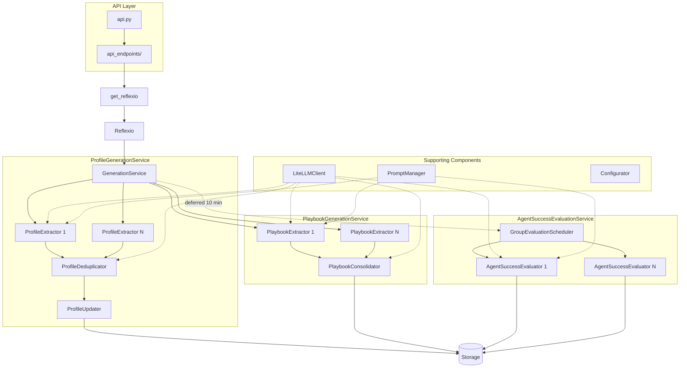

# Reflexio Server
Description: FastAPI backend server that processes user interactions to generate profiles, extract playbooks, and evaluate agent success

## Table of Contents

- [Main Entry Points](#main-entry-points)
- [Cache](#cache)
- [API Endpoints](#api-endpoints)
- [LLM Client](#llm-client)
- [Prompts](#prompts)
- [Site Variables](#site-variables)
- [Scripts](#scripts)
- [Services](#services)
  - [Orchestrator](#orchestrator)
  - [Base Infrastructure](#base-infrastructure)
  - [Profile Generation](#profile-generation)
  - [Playbook Extraction](#playbook-extraction)
  - [Agent Success Evaluation](#agent-success-evaluation)
  - [Reflection and Async Extraction](#reflection-and-async-extraction)
  - [Shadow Comparison and Evaluation Overview](#shadow-comparison-and-evaluation-overview)
  - [Playbook Optimizer and Braintrust](#playbook-optimizer-and-braintrust)
  - [Query Reformulator](#query-reformulator)
  - [Unified Search Service](#unified-search-service)
  - [Storage](#storage)
  - [Configurator](#configurator)
- [Architecture Patterns](#architecture-patterns)
  - [Request Flow](#request-flow)
  - [Service Pattern](#service-pattern)
  - [Key Rules](#key-rules)
- [See Also](#see-also)

## Main Entry Points

- **API**: `api.py` - FastAPI routes (only place to expose endpoints)
- **Endpoint Helpers**: `api_endpoints/` - Bridge between routes and business logic
- **Core Service**: `services/generation_service.py` - Main orchestrator

## Cache

**Directory**: `cache/`

| File | Purpose |
|------|---------|
| `reflexio_cache.py` | TTL-cached Reflexio instances (1 hour TTL, max 100 orgs) |

**Key Functions**:
- `get_reflexio(org_id)` - Get or create cached instance
- `invalidate_reflexio_cache(org_id)` - Invalidate after config changes
- `clear_reflexio_cache()` - Clear entire cache (testing/admin)

**Pattern**: **ALWAYS use `get_reflexio()`** instead of `Reflexio()` directly in API endpoints

## API Endpoints

**Directory**: `api_endpoints/`

| File | Purpose |
|------|---------|
| `request_context.py` | RequestContext (bundles org_id, storage, configurator, prompt_manager) |
| `publisher_api.py` | Publishing interactions plus direct create/update/delete helpers for profiles, playbooks, requests, sessions, and clear-data operations |
| `account_api.py` | Account/config identity helpers used by `/api/whoami` and related account surfaces |
| `health_api.py` | `/healthz` and `/healthz/eval` health checks |
| `pending_tool_call_api.py` | Pending tool-call and human-clarification routes for resumable extraction |
| `stall_state_api.py` | Stall-state read/update routes |
| `precondition_checks.py` | Request validation |

**Key Endpoints**:
- **Health/version**: `GET /`, `GET /health`, `GET /healthz`, `GET /healthz/eval`, `GET /meta/version`
- **Identity/config**: `GET /api/whoami`, `GET /api/my_config`, `GET /api/get_config`, `POST /api/set_config`, `POST /api/update_config`
- **Publish/direct writes**: `POST /api/publish_interaction`, `POST /api/add_user_profile`, `POST /api/add_user_playbook`, `POST /api/add_agent_playbook`
- **Retrieval**: `POST /api/get_requests`, `POST /api/get_interactions`, `GET /api/get_all_interactions`, `POST /api/get_profiles`, `GET /api/get_all_profiles`, `POST /api/get_user_playbooks`, `POST /api/get_agent_playbooks`, `POST /api/get_agent_success_evaluation_results`
- **Search/stats**: `POST /api/search`, `POST /api/search_profiles`, `POST /api/rerank_user_profiles`, `POST /api/search_interactions`, `POST /api/search_user_playbooks`, `POST /api/search_agent_playbooks`, `GET /api/storage_stats`, `GET /api/get_profile_statistics`, `POST /api/get_dashboard_stats`, `POST /api/get_playbook_application_stats`
- **Profile lifecycle**: `POST /api/rerun_profile_generation`, `POST /api/manual_profile_generation`, `POST /api/upgrade_all_profiles`, `POST /api/downgrade_all_profiles`, `GET /api/profile_change_log`, `PUT /api/update_user_profile`, `DELETE /api/delete_profile`, `DELETE /api/delete_profiles_by_ids`, `DELETE /api/delete_all_profiles`
- **Playbook lifecycle**: `POST /api/rerun_playbook_generation`, `POST /api/manual_playbook_generation`, `POST /api/run_playbook_aggregation`, `GET /api/playbook_aggregation_change_logs`, `POST /api/upgrade_all_user_playbooks`, `POST /api/downgrade_all_user_playbooks`, `PUT /api/update_agent_playbook_status`, `PUT /api/update_agent_playbook`, `PUT /api/update_user_playbook`, `DELETE /api/delete_agent_playbook`, `DELETE /api/delete_user_playbook`, `DELETE /api/delete_agent_playbooks_by_ids`, `DELETE /api/delete_user_playbooks_by_ids`, `DELETE /api/delete_all_playbooks`, `DELETE /api/delete_all_user_playbooks`, `DELETE /api/delete_all_agent_playbooks`
- **Evaluation**: `POST /api/get_evaluation_overview`, `POST /api/evaluations/regenerate`, `GET /api/evaluations/regenerate/{job_id}`, `DELETE /api/evaluations/regenerate/{job_id}`, `POST /api/evaluations/grade_on_demand`, `GET /api/evaluations/shadow_comparisons/recent`
- **Braintrust**: `POST /api/braintrust/connect`, `POST /api/braintrust/select_projects`, `GET /api/braintrust/status`, `DELETE /api/braintrust/connection`, `POST /api/braintrust/sync`
- **Operations/admin**: `GET /api/get_operation_status`, `POST /api/cancel_operation`, `POST /api/admin/cache/invalidate`, `DELETE /api/delete_interaction`, `DELETE /api/delete_request`, `DELETE /api/delete_session`, `DELETE /api/delete_requests_by_ids`, `DELETE /api/delete_all_interactions`, `POST /api/clear_user_data`
- **Human clarification/stall state**: `GET /api/pending_tool_calls`, `GET /api/pending_tool_calls/{pending_tool_call_id}`, `POST /api/pending_tool_calls/{pending_tool_call_id}/resolve`, `PATCH /api/pending_tool_calls/{pending_tool_call_id}/answer`, `POST /api/pending_tool_calls/{pending_tool_call_id}/not_applicable`, `POST /api/pending_tool_calls/{pending_tool_call_id}/cancel`, `GET /api/stall_state`, `POST /api/stall_state/notified`

**Authentication Pattern**: The open-source app uses `default_get_org_id` and `DEFAULT_ORG_ID` for local/no-auth starts. The enterprise extension wraps `create_app()` with authenticated org resolution, login/OAuth/account/share/waitlist routers, admin checks, Sentry tracing, and usage metrics.

**Pattern**: Core route handlers call `Reflexio` through `get_reflexio(org_id)`; endpoint helper files should not instantiate `Reflexio` directly.

## LLM Client

**Directory**: `llm/`
**Entry Point**: `litellm_client.py` - `LiteLLMClient`

Key files:
- `litellm_client.py`: Unified LiteLLMClient using LiteLLM for multi-provider support
- `openai_client.py`: OpenAI implementation (legacy, do not use directly)
- `claude_client.py`: Claude implementation (legacy, do not use directly)
- `llm_utils.py`: Helper functions for Pydantic model conversion

**Features**:
- Uses LiteLLM for multi-provider support (OpenAI, Claude, Azure, OpenRouter, Gemini, custom endpoints, etc.)
- **Custom endpoint support**: `CustomEndpointConfig` (model, api_key, api_base) takes priority over all other providers for LLM completion calls when configured with non-empty fields (but not embeddings)
- **Gemini support**: Model names with `gemini/` prefix route through Google Gemini; API key from `api_key_config.gemini`
- **OpenRouter support**: Model names with `openrouter/` prefix (e.g., `openrouter/openai/gpt-5-nano`) route through OpenRouter; API key from `api_key_config.openrouter`
- API keys read from environment variables (OPENAI_API_KEY, ANTHROPIC_API_KEY) or `ApiKeyConfig`
- Interface: `generate_response()`, `generate_chat_response()`, `get_embedding()`
- **Structured Outputs**: Supports Pydantic models via `response_format` parameter
- Return types: `str` for text, or `BaseModel` for Pydantic models

**Usage**:
```python
from reflexio.server.llm.litellm_client import LiteLLMClient, LiteLLMConfig

# Create client
config = LiteLLMConfig(model="gpt-4o-mini")
client = LiteLLMClient(config)

# Text response
response = client.generate_response("Hello")  # Returns str

# Structured output with Pydantic model
from pydantic import BaseModel
class Answer(BaseModel):
    result: int
response = client.generate_response("What is 2+2?", response_format=Answer)  # Returns Answer instance
```

**Rules**:
- **ALWAYS use `LiteLLMClient`**, never import `OpenAIClient` or `ClaudeClient` directly
- **ALWAYS use Pydantic models** for structured outputs (dict-based schemas are not supported)

## Prompts

**Directory**: `prompt/`

**Detailed Documentation**: See [`prompt/prompt_bank/README.md`](prompt/prompt_bank/README.md) for the versioned template system.

Key components:
- `prompt_manager.py`: PromptManager for loading and rendering
- `prompt_bank/`: Templates by prompt_id (metadata.json + version.prompt files)

**Pattern**: Access via `request_context.prompt_manager.render_prompt(prompt_id, variables)`

## Site Variables

**Directory**: `site_var/`

**Detailed Documentation**: See [`site_var/README.md`](site_var/README.md) for the full configuration and feature flag system.

| File | Purpose |
|------|---------|
| `site_var_manager.py` | SiteVarManager (singleton) - loads JSON/TXT configs |
| `feature_flags.py` | Per-org feature gating (`is_feature_enabled()`, `get_all_feature_flags()`) |

**Feature Flags**: Config in `site_var_sources/feature_flags.json`. Each flag has global `enabled` toggle and per-org `enabled_org_ids` allowlist. Unknown flags default to enabled (fail-open). Currently gates: `invitation_only` (global flag, gates registration to require invitation codes), `deduplicator` (gates playbook deduplication).

Access: `SiteVarManager().get_site_var(key)` for raw values, `feature_flags.is_feature_enabled(org_id, name)` for flag checks

## Scripts

**Directory**: `scripts/`

| File | Purpose |
|------|---------|
| `manage_invitation_codes.py` | CLI to generate and list invitation codes |
| `show_raw_feedback_with_interactions.py` | Debug script to display user playbook alongside interaction context |

**Usage**:
```shell
python -m reflexio.server.scripts.manage_invitation_codes generate --count 5
python -m reflexio.server.scripts.manage_invitation_codes generate --count 3 --expires-in-days 30
python -m reflexio.server.scripts.manage_invitation_codes list
python -m reflexio.server.scripts.manage_invitation_codes list --show-used
```

## Services

**Directory**: `services/`

**Service Boundary**: The service layer owns LLM orchestration, extraction, evaluation, optimization, search preparation, storage access, and long-running operation state. API endpoints should validate/authenticate requests, build `RequestContext`, and delegate into `Reflexio` or focused service helpers rather than embedding business logic.

**Encapsulated Components**:
- **Publish pipeline**: `generation_service.py` coordinates interaction persistence, profile generation, playbook generation, reflection, and deferred evaluation scheduling.
- **Profile memory**: `profile/` extracts, deduplicates, and applies user profile updates.
- **Playbook memory**: `playbook/` extracts user playbooks, consolidates them against existing rows, aggregates them into agent playbooks, and tracks aggregation change logs.
- **Evaluation**: `agent_success_evaluation/`, `shadow_comparison/`, and `evaluation_overview/` handle session grading, per-turn shadow verdicts, regeneration jobs, and dashboard-facing rollups.
- **Async clarification**: `extraction/` and `reflection/` manage resumable agent runs, pending tool calls, prior-answer search, and long-horizon reflection updates.
- **Search preparation**: `pre_retrieval/` and `unified_search_service.py` handle query reformulation, document expansion, embeddings, and cross-entity search orchestration.
- **Optimization/integrations**: `playbook_optimizer/` and `braintrust/` run candidate playbook optimization, rollout support, and Braintrust export/sync.
- **Persistence/config**: `storage/`, `configurator/`, and `operation_state_utils.py` provide storage abstractions, config loading, locks, bookmarks, progress, and cancellation.

### Orchestrator

**File**: `generation_service.py` - GenerationService

Main orchestrator flow:
1. Save interactions to storage
2. Run ProfileGenerationService, PlaybookGenerationService in parallel (ThreadPoolExecutor, 2 workers)
3. Schedule deferred agent success evaluation via `GroupEvaluationScheduler` when `session_id` is present (10 min delay after last request in session)

**Timeout Protection**: Two-layer timeout strategy:
- **Service level**: `GENERATION_SERVICE_TIMEOUT_SECONDS = 600` (10 min) — outer timeout for each parallel service
- **Extractor level**: `EXTRACTOR_TIMEOUT_SECONDS = 300` (5 min) — per-extractor safety net in `base_generation_service.py`
- If one service/extractor times out, others continue unaffected

**Stride Size Processing**: Each extractor independently checks if it should run based on its configured stride_size size and tracks its own operation state.

Called by API endpoints via `Reflexio`

**Profile Timeout Troubleshooting**:
- Use `python -m reflexio.scripts.reproduce_profile_timeout --mode storage --org-id <org> --user-id <user>` to reproduce with real interactions.
- Use `--mode log --log-path server_log.txt` to replay extraction prompts captured in logs.
- Look for structured events in logs:
  - `event=profile_extract_llm_start` / `event=profile_extract_llm_end`
  - `event=llm_request_start` / `event=llm_request_end`
  - `event=profile_extract_failed`
- If all extractors fail for a user during rerun/manual operations, the user is now marked in `failed_user_ids` instead of silently completing with zero generated items.

### Base Infrastructure

- `base_generation_service.py`: Abstract base for all services (parallel extractor execution via ThreadPoolExecutor, `EXTRACTOR_TIMEOUT_SECONDS = 300` per-extractor safety timeout)
- `extractor_config_utils.py`: Shared utility for filtering extractor configs by source, `allow_manual_trigger`, and extractor names
- `extractor_interaction_utils.py`: Per-extractor utilities for stride_size checking and source filtering
- `operation_state_utils.py`: Centralized `OperationStateManager` for all `_operation_state` table interactions (progress tracking, concurrency locks, extractor/aggregator bookmarks, simple locks)
- `deduplication_utils.py`: Shared utilities for LLM-based deduplication (used by ProfileDeduplicator and PlaybookConsolidator)
- `service_utils.py`: Utilities (`construct_messages_from_interactions()`, `format_interactions_to_history_string()` (prepends tool usage info when `tools_used` is present), `extract_json_from_string()`, `log_model_response()` for colored LLM response logging)

**Operation State Management** (via `OperationStateManager` in `operation_state_utils.py`):
- Centralized manager for all `_operation_state` table interactions with 6 use cases:
  1. **Progress tracking**: Rerun + manual batch operations (key: `{service}::{org_id}::progress`)
  2. **Concurrency lock**: Atomic lock with request queuing (key: `{service}::{org_id}[::scope_id]::lock`)
  3. **Extractor bookmark**: Track last-processed interactions per extractor (key: `{service}::{org_id}[::scope_id]::{name}`)
  4. **Aggregator bookmark**: Track last-processed raw_feedback_id per aggregator
  4b. **Cluster fingerprints**: Track cluster membership fingerprints for change detection (key: `{service}::{org_id}::{name}[::version]::clusters`)
  5. **Simple lock**: Non-queuing lock for cleanup operations
  6. **Cancellation**: Cooperative cancellation for batch operations (`request_cancellation()`, `is_cancellation_requested()`, `mark_cancelled()`). Uses separate DB row (key: `{service}::{org_id}::cancellation`) to avoid lost-update race conditions with progress updates.
- Stale lock timeout: 5 minutes (assumes crashed if lock held longer)
- Lock scoping: Profile generation = per-user, Playbook generation = per-org
- Re-run mechanism: If new request arrives during generation, `pending_request_id` is set and generation re-runs after completion

### Profile Generation

**Directory**: `services/profile/`

Key files:
- `profile_generation_service.py`: Service orchestrator
- `profile_extractor.py`: Extractor that generates profile updates
- `profile_updater.py`: Applies updates (add/delete/mention) to storage
- `profile_deduplicator.py`: Deduplicates newly extracted profiles against existing DB profiles using LLM

**Flow**: Interactions → ProfileExtractor (extraction-only) → ProfileDeduplicator (deduplicates new vs existing DB profiles) → ProfileUpdater → Storage

**Generation Modes** (detailed comparison):

| Aspect | Regular | Rerun | Manual Regular |
|--------|---------|-------|----------------|
| **Trigger** | Auto (on publish) | Manual (API) | Manual (API) |
| **Stride Check** | Yes (skips if below threshold) | No (always runs) | No (always runs) |
| **Interactions** | Window-sized (last k) | Window-sized (last k) | Window-sized (last k) |
| **Time Range Filter** | No | Yes (optional start/end) | No |
| **Pre-processing** | None | None | None |
| **Existing Profile Context** | All profiles loaded | Only PENDING profiles loaded | All profiles loaded |
| **Output Status** | CURRENT | PENDING | CURRENT |
| **Scope** | Single user | Batch (all matching users, with progress) | Batch (all/single user, with progress) |
| **Use Case** | Normal operation | Test prompt changes | Force regeneration |

**Note**: All modes use `window_size` (per-extractor override or global). The key difference is that Regular checks stride_size before running, while Rerun/Manual always run. When no window is configured, rerun/manual falls back to `k=1000`.

**Constructor Flags** (`ProfileGenerationService`):
- `allow_manual_trigger`: Include `manual_trigger=True` extractors (default: False)
- `output_pending_status`: Set output profiles to PENDING status (default: False)

**Profile Versioning Workflow**:

Users can regenerate and manage profile versions using a four-state system:

1. **CURRENT** (status=None): Active profiles shown to users
2. **PENDING** (status="pending"): Newly generated profiles awaiting review
3. **ARCHIVED** (status="archived"): Previous version of profiles
4. **ARCHIVE_IN_PROGRESS** (status="archive_in_progress"): Temporary status during downgrade operation

**Rerun Workflow**:
```
1. Rerun Generation → Creates PENDING profiles (existing CURRENT unchanged)
2. Review PENDING → Compare new vs current profiles
3. Upgrade → CURRENT→ARCHIVED, PENDING→CURRENT, delete old ARCHIVED
4. OR Downgrade → CURRENT→ARCHIVED (restore previous version), ARCHIVED→CURRENT (swap)
```

**Upgrade Process** (3 atomic steps):
1. Archive all CURRENT profiles → ARCHIVED
2. Promote all PENDING profiles → CURRENT
3. Delete all old ARCHIVED profiles

**Downgrade Process** (3 atomic steps):
1. Mark all CURRENT profiles → ARCHIVE_IN_PROGRESS (temporary)
2. Restore all ARCHIVED profiles → CURRENT
3. Complete archiving: ARCHIVE_IN_PROGRESS → ARCHIVED

**Use Cases**:
- Test prompt changes without affecting production profiles
- Review AI-generated updates before deployment
- Rollback to previous profile version if needed

### Playbook Extraction

**Directory**: `services/playbook/`

**Detailed Documentation**: See [`services/playbook/README.md`](services/playbook/README.md) for detailed component documentation.

Key files:
- `playbook_generation_service.py`: Service orchestrator
- `playbook_extractor.py`: Extractor that extracts user playbooks
- `playbook_aggregator.py`: Aggregates similar user playbooks (with cluster-level change detection to skip unchanged clusters)
- `playbook_consolidator.py`: Reconciles newly extracted playbooks against existing DB playbooks using LLM

**Flow**:
- Interactions → PlaybookExtractor (extraction-only) → PlaybookConsolidator (consolidates new vs existing DB playbooks) → UserPlaybook (with optional `blocking_issue`) → Storage
- UserPlaybook (manual trigger) → PlaybookAggregator → cluster fingerprint comparison → LLM only for changed clusters → AgentPlaybook (with optional `blocking_issue`) → Storage

**Tool Analysis**: PlaybookExtractor reads `tool_can_use` from root `Config` and passes it to prompts for tool usage analysis and blocking issue detection.

**Rerun Behavior**: Groups interactions by `user_id` for per-user playbook extraction (fetches all users, then processes each user's interactions together)

**Playbook Aggregation with Cluster Change Detection** (`playbook_aggregator.py`):

Aggregation clusters user playbooks by embedding similarity, then calls LLM per cluster to produce aggregated agent playbooks. Cluster-level change detection avoids redundant LLM calls on subsequent runs:

1. Cluster all user playbooks (agglomerative for <50, HDBSCAN for >=50)
2. Compute fingerprint per cluster (SHA-256 of sorted `raw_feedback_id`s, 16 hex chars)
3. Compare against stored fingerprints from previous run (via `OperationStateManager.get_cluster_fingerprints`)
4. Only call LLM for changed/new clusters; carry forward existing agent playbooks for unchanged clusters
5. Archive old agent playbooks only for changed/disappeared clusters (via `archive_feedbacks_by_ids`)
6. Store new fingerprints with feedback_id mapping (via `OperationStateManager.update_cluster_fingerprints`)

| Scenario | Behavior |
|---|---|
| First run (no stored fingerprints) | All clusters treated as changed, full LLM run |
| `rerun=True` | Bypasses fingerprint comparison, full archive/regenerate |
| No changes | Logs skip message, updates bookmark, returns early |
| Error during save | Restores only selectively archived playbooks |

**Change Log Tracking**: After each aggregation run, a `PlaybookAggregationChangeLog` is saved with before/after snapshots of added, removed, and updated playbooks. Viewable via `GET /api/playbook_aggregation_change_logs`. Change log saving is best-effort (failures are logged but don't block aggregation).

**Generation Modes** (detailed comparison):

| Aspect | Regular | Rerun | Manual Regular |
|--------|---------|-------|----------------|
| **Trigger** | Auto (on publish) | Manual (API) | Manual (API) |
| **Stride Check** | Yes (skips if below threshold) | No (always runs) | No (always runs) |
| **Interactions** | Window-sized (last k) | Window-sized (last k) | Window-sized (last k) |
| **Time Range Filter** | No | Yes (optional start/end) | No |
| **Pre-processing** | None | Deletes existing PENDING user playbooks | None |
| **Output Status** | CURRENT | PENDING | CURRENT |
| **Scope** | Single user | Batch (all matching users, with progress) | Batch (all/single user, with progress) |
| **Use Case** | Normal operation | Test prompt changes | Force regeneration |

**Note**: All modes use `window_size` (per-extractor override or global). The key difference is that Regular checks stride_size before running, while Rerun/Manual always run. When no window is configured, rerun/manual falls back to `k=1000`.

**Constructor Flags** (`PlaybookGenerationService`):
- `allow_manual_trigger`: Include `manual_trigger=True` extractors (default: False)
- `output_pending_status`: Set output user playbooks to PENDING status (default: False)

**User Playbook Versioning Workflow**:

Similar to profiles, user playbooks support versioning:

1. **CURRENT** (status=None): Active user playbooks
2. **PENDING** (status="pending"): Newly generated user playbooks awaiting review
3. **ARCHIVED** (status="archived"): Previous version of user playbooks

**Rerun Workflow**:
```
1. Rerun Playbook Generation → Creates PENDING user playbooks
2. Review PENDING → Compare new vs current
3. Upgrade → CURRENT→ARCHIVED, PENDING→CURRENT, delete old ARCHIVED
4. OR Downgrade → Swap ARCHIVED↔CURRENT
```

### Agent Success Evaluation

**Directory**: `services/agent_success_evaluation/`

Key files:
- `agent_success_evaluation_service.py`: Service orchestrator (tracks run outcome flags: `last_run_result_count`, `has_run_failures()`)
- `agent_success_evaluator.py`: Evaluates success at session level (all interactions as one group)
- `agent_success_evaluation_constants.py`: Output schema (`AgentSuccessEvaluationOutput`)
- `agent_success_evaluation_utils.py`: Message construction utilities
- `delayed_group_evaluator.py`: `GroupEvaluationScheduler` singleton - min-heap priority queue with daemon thread, defers evaluation until 10 min after last request in session
- `group_evaluation_runner.py`: `run_group_evaluation()` - fetches all requests/interactions for a session, builds `RequestInteractionDataModel` list, runs evaluation

**Flow**: Interactions → (deferred 10 min) → GroupEvaluationScheduler → run_group_evaluation → AgentSuccessEvaluator → AgentSuccessEvaluationResult → Storage

**Session-Level Evaluation**: Evaluator treats all `request_interaction_data_models` in a session as a single conversation. Sampling rate checked once per session (not per-request). Result keyed by `session_id` (not `request_id`).

**Tool Context**: Reads `tool_can_use` from root `Config` level (shared with playbook extraction).

**Shadow Comparison**: Session-level shadow comparison was retracted in F1 because multi-turn shadow content suffers from trajectory contamination (turn 2+ user messages react to the regular response, not the shadow). The `regular_vs_shadow` field on `AgentSuccessEvaluationResult` is preserved as a nullable historical column but is always `None` on newly produced rows. Per-turn shadow comparison lives in a dedicated `services/shadow_comparison/` judge that writes its verdicts to a separate table — see the F1 spec.

### Reflection and Async Extraction

**Directories**: `services/reflection/`, `services/extraction/`

Key files:
- `reflection/reflection_service.py`: Post-horizon reflection orchestration for synthesizing longer-range memory artifacts
- `reflection/reflection_extractor.py`: LLM extractor used by the reflection service
- `extraction/resumable_agent.py`: Resumable extraction agent runtime
- `extraction/resume_scheduler.py` and `extraction/resume_worker.py`: Background scheduling/worker loop for paused extraction runs
- `extraction/tools.py` and `extraction/prior_answer_search.py`: Tool surface for async extraction agents
- `extraction/agent_run_records.py`: Persistence helpers for extraction-agent run state

**Pattern**: Synchronous profile/playbook/evaluation services still follow `BaseGenerationService`; async extraction uses resumable agent-run records and worker scheduling so long-running or tool-mediated extraction can continue outside the request path.

### Shadow Comparison and Evaluation Overview

**Directories**: `services/shadow_comparison/`, `services/evaluation_overview/`

Key files:
- `shadow_comparison/judge.py`: Per-turn regular-vs-shadow judge that writes shadow verdicts through storage
- `shadow_comparison/outcome.py`: Verdict outcome model helpers
- `evaluation_overview/service.py`: Aggregates evaluation-page metrics
- `evaluation_overview/hero_state.py`, `distribution.py`, `group_aggregation.py`, `rule_attribution.py`, `shadow_aggregation.py`: Focused aggregation helpers

**Pattern**: Session-level agent success evaluation remains in `agent_success_evaluation/`; dashboard-facing rollups and per-turn shadow verdict analysis live in these companion directories.

### Playbook Optimizer and Braintrust

**Directories**: `services/playbook_optimizer/`, `services/braintrust/`

Key files:
- `playbook_optimizer/optimizer.py`: Scenario-based playbook optimization loop
- `playbook_optimizer/scheduler.py` and `rollout.py`: Scheduling and rollout helpers
- `playbook_optimizer/judge.py`, `models.py`, `scenario_resolver.py`: Evaluation and scenario resolution models
- `playbook_optimizer/assistant_webhook.py`: Assistant-facing webhook entry point for optimizer runs
- `braintrust/service.py`, `braintrust/client.py`, `_cron.py`: Braintrust export/sync support

**Pattern**: These are evaluation/optimization integrations around the core playbook pipeline. Keep production extraction changes in `services/playbook/`; use optimizer/Braintrust modules for experiments, rollouts, and external eval sync.

### Query Reformulator

**File**: `services/pre_retrieval/_query_reformulator.py` - `QueryReformulator`

Reformulates user search queries into clean, normalized natural language for improved search recall. Resolves conversation context, expands abbreviations, fixes grammar. Enabled per-request via `enable_reformulation` parameter.

- Uses `pre_retrieval_model_name` from `llm_model_setting.json` (fast, cheap model)
- Supports conversation-aware reformulation via `conversation_history` (list of `ConversationTurn`)
- Plain-text LLM output with robust extraction/validation
- Falls back to original query on any failure
- Prompt: `prompt_bank/query_reformulation/`

### Unified Search Service

**File**: `services/unified_search_service.py` - `run_unified_search()`

Searches across all entity types (profiles, agent_playbooks, user_playbooks) in parallel via a two-phase approach:

- **Phase A**: Query rewriting + embedding generation (parallel via ThreadPoolExecutor)
- **Phase B**: Entity searches across all types (parallel via ThreadPoolExecutor, 3 workers)

Pre-computed embeddings passed to storage methods via `query_embedding` parameter to avoid redundant embedding calls.

### Storage

**Directory**: `services/storage/`

| File | Purpose |
|------|---------|
| `storage_base/` | BaseStorage interface split by domain (`_profiles.py`, `_playbook.py`, `_requests.py`, `_operations.py`, `_agent_run.py`, `_shadow_verdicts.py`, `_stall_state.py`, `_share_links.py`) |
| `sqlite_storage/` | SQLite-backed implementation split across the same domains |
| `retention.py`, `retention_mixin.py` | Data retention and cleanup helpers |
| `constants.py`, `error.py` | Storage constants and shared errors |

**Pattern**: **NEVER import storage implementations directly** - Always use `request_context.storage`

**Key Methods**:
- CRUD: profiles, interactions, playbooks, results, requests, playbook aggregation change logs
- `get_sessions(offset, top_k, session_id)` → `dict[str, list[RequestInteractionDataModel]]` (groups by session_id, supports offset/limit pagination)
- `get_rerun_user_ids(user_id, start_time, end_time, source, agent_version)` → `list[str]` - Get distinct user IDs matching filters for rerun workflows (pushes filtering to storage layer)
- `get_feedbacks(status_filter, feedback_status_filter)` - Filter by playbook status and approval status
- `save_feedbacks()` → returns `list[Feedback]` with `feedback_id` populated (callers can ignore return)
- Selective playbook operations (used by cluster change detection):
  - `archive_feedbacks_by_ids(feedback_ids)` - Archive specific agent playbooks by ID (skips APPROVED)
  - `restore_archived_feedbacks_by_ids(feedback_ids)` - Restore archived agent playbooks by ID
  - `delete_feedbacks_by_ids(feedback_ids)` - Delete agent playbooks by ID
  - `delete_raw_feedbacks_by_ids(raw_feedback_ids)` - Delete user playbooks by ID
- Vector search via LiteLLMClient embeddings
- Operation state: `get_operation_state()`, `upsert_operation_state()`, `get_operation_state_with_new_request_interaction()`, `try_acquire_in_progress_lock()`
- All operation state interactions are managed through `OperationStateManager` (in `operation_state_utils.py`)
- Profile status: `Status` enum (CURRENT=None, PENDING, ARCHIVED)

### Configurator

**Directory**: `services/configurator/`

Key files:
- `configurator.py`: DefaultConfigurator - loads YAML config, creates storage
- `local_file_config_storage.py`: Local file-based config storage
**Config Storage Priority** (in `DefaultConfigurator`):
1. **Local** - If `base_dir` is explicitly provided (testing)
2. **Local File** - Default fallback

**Path Handling**: LocalFileConfigStorage automatically converts relative paths to absolute using `os.path.abspath()`

Access: `request_context.configurator`

## Architecture Patterns

### Request Flow
```
API Request (api.py)
  -> API Endpoint (api_endpoints/)
    -> get_reflexio() (cache/)
      -> Reflexio (reflexio_lib.py)
        -> GenerationService
          ├─> ProfileGenerationService → Storage
          ├─> PlaybookGenerationService → Storage
          └─> GroupEvaluationScheduler (deferred 10 min) → run_group_evaluation → Storage
```



### Service Pattern

All services follow BaseGenerationService:
1. Load extractor configs from YAML
2. Load generation service config from request (runtime parameters)
3. Filter extractors by source, `allow_manual_trigger`, and extractor names (via `extractor_config_utils`)
4. Create extractors with both configs
5. Run extractors in parallel (ThreadPoolExecutor)
6. Process and save results to storage

**Extractor Pattern**: Multiple extractors run in parallel, each handling its own data collection. Each extractor:
- Receives **ExtractorConfig** (from YAML): Static configuration like prompts and settings
- Receives **GenerationServiceConfig** (from request): Runtime parameters like user_id, source
- **Collects its own interactions** using `extractor_interaction_utils.py`:
  - Gets per-extractor window_size/stride_size parameters (override or global fallback)
  - Applies source filtering based on `request_sources_enabled`
  - Checks stride_size threshold before running
  - Updates per-extractor bookmark state after processing (via `OperationStateManager`)

**Per-Extractor Window Overrides**: Each extractor config can override global window settings:
- `window_size_override`: Override global `window_size` for this extractor
- `stride_size_override`: Override global `stride_size` for this extractor
- Each extractor applies its own override or falls back to global values

### Key Rules

**Reflexio Instances**:
- **NEVER instantiate `Reflexio()` directly** in API endpoints
- **ALWAYS use**: `get_reflexio(org_id)` from `cache/reflexio_cache.py`
- Cache invalidated automatically on config changes

**Storage**:
- **NEVER import storage implementations directly**
- **ALWAYS use**: `request_context.storage` (type: BaseStorage)

**LLM**:
- **NEVER import OpenAIClient/ClaudeClient directly**
- **ALWAYS use**: `LiteLLMClient` (uses LiteLLM for multi-provider support)

**Prompts**:
- **NEVER hardcode prompts**
- **ALWAYS use**: `request_context.prompt_manager.render_prompt(prompt_id, variables)`
- Prompts versioned in `prompt_bank/`

## See Also

- [Code Map (root README)](../README.md) -- high-level overview of all Reflexio components
- [Prompt Bank README](prompt/prompt_bank/README.md) -- versioned prompt template system
- [Playbook Service README](services/playbook/README.md) -- playbook extraction, aggregation, and deduplication pipeline
- [Site Variables README](site_var/README.md) -- global configuration and feature flags
